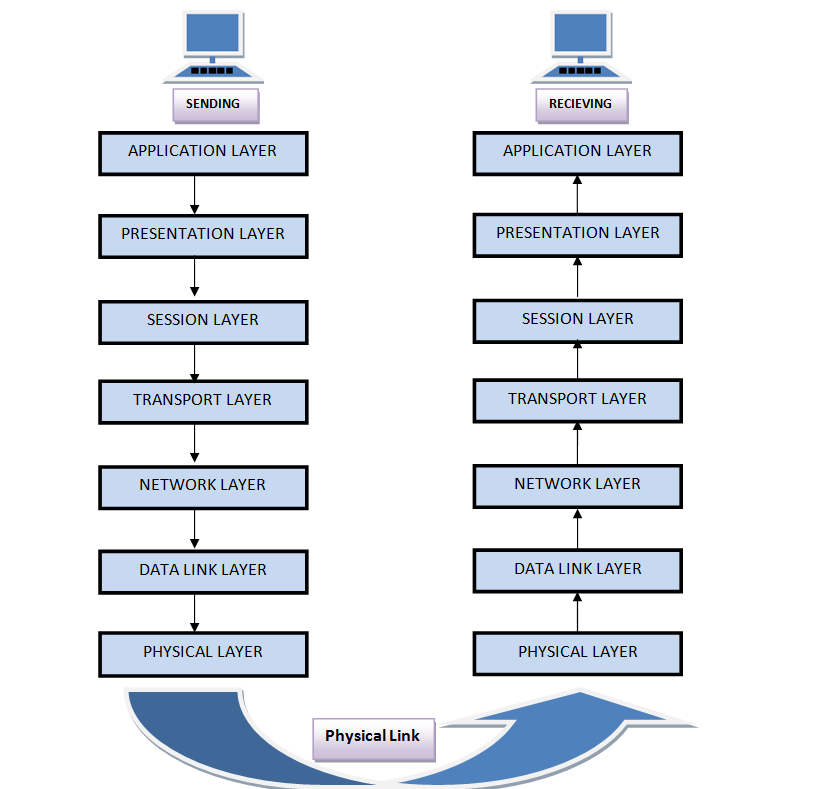

# Open Systems Interconnection ( OSI )

Dalam model OSI, sistem komunikasi diasumsikan terhubung dengan media fisik yang menyediakan mekanisme transmisi dasar (dan tidak ditentukan). Lapisan di atasnya diberi nomor (dari satu sampai tujuh) lapisan ke-n disebut sebagai (n)-lapisan. Setiap lapisan menyediakan layanan ke lapisan di atasnya (atau di atas ke proses aplikasi) menggunakan layanan dari lapisan tepat di bawahnya. Lapisan berkomunikasi satu sama lain melalui antarmuka, yang disebut titik akses layanan. Lapisan yang sesuai pada setiap sistem disebut entitas peer. Untuk berkomunikasi, dua entitas peer pada lapisan tertentu menggunakan protokol (n), yang diimplementasikan dengan menggunakan layanan lapisan (n-1). Ketika sistem tidak terhubung langsung, entitas peer perantara (disebut relai) digunakan. Alamat secara unik mengidentifikasi titik akses layanan. Domain penamaan alamat tidak perlu dibatasi pada satu lapisan, sehingga dimungkinkan untuk menggunakan hanya satu domain penamaan untuk semua lapisan. Untuk setiap lapisan ada dua jenis standar: standar protokol yang menentukan bagaimana entitas peer pada lapisan tertentu berkomunikasi, dan standar layanan yang menentukan bagaimana lapisan tertentu berkomunikasi dengan lapisan di atasnya.

## Layer Aplikasi (Application Layer)

Layer ini dapat menyediakan layanan berikut kepada proses aplikasi: identifikasi mitra komunikasi yang dimaksud, pembentukan otoritas yang diperlukan untuk berkomunikasi, penentuan ketersediaan dan otentikasi mitra, kesepakatan pada mekanisme privasi untuk komunikasi, kesepakatan pada tanggung jawab pemulihan kesalahan dan prosedur untuk memastikan integritas data, sinkronisasi antara proses aplikasi yang bekerja sama, identifikasi batasan-batasan pada sintaks (misalnya, set karakter dan struktur data), penentuan biaya dan kualitas layanan yang dapat diterima, pemilihan disiplin dialog, termasuk prosedur log masuk (logon) dan log keluar (logoff) yang diperlukan.

## Layer Presentasi (Presentation Layer)

Layer ini dapat menyediakan layanan berikut kepada lapisan aplikasi: permintaan pembentukan sesi, transfer data, negosiasi sintaks yang akan digunakan antara lapisan aplikasi, transformasi sintaks yang diperlukan, pemformatan, dan transformasi khusus (misalnya, kompresi data dan enkripsi data).

## Layer Sesi (Session Layer)

Layer ini dapat menyediakan layanan berikut kepada lapisan presentasi: pembentukan dan pelepasan koneksi sesi, pertukaran data normal dan cepat, layanan karantina yang memungkinkan entitas presentasi pengirim untuk menginstruksi entitas sesi penerima untuk tidak melepaskan data ke entitas presentasinya tanpa izin, pengelolaan interaksi sehingga entitas presentasi dapat mengendalikan giliran siapa yang melakukan fungsi pengendalian tertentu, resinkronisasi koneksi sesi, pelaporan pengecualian yang tidak dapat dipulihkan ke entitas presentasi.

## Layer Transportasi (Transport Layer)

Layer transportasi menyediakan transfer data yang andal dan transparan dengan cara yang efektif sesuai dengan kualitas layanan yang dipilih. Ini dapat mendukung multiplexing dari beberapa koneksi transportasi ke satu koneksi jaringan atau membagi satu koneksi transportasi menjadi beberapa koneksi jaringan.

## Layer Jaringan (Network Layer)

Layer jaringan melakukan pengaturan, pemeliharaan, dan pelepasan jalur jaringan antara entitas peer transportasi. Ketika relai diperlukan, fungsi routing dan relay disediakan oleh lapisan ini. Kualitas layanan dinegosiasikan antara entitas jaringan dan transportasi pada saat koneksi dibuat. Lapisan ini juga bertanggung jawab atas pengendalian kemacetan jaringan.

## Layer Data Link (Data Link Layer)

Layer data link melakukan pengaturan, pemeliharaan, dan pelepasan koneksi data link. Kesalahan yang terjadi dalam lapisan fisik dideteksi dan dapat diperbaiki. Kesalahan dilaporkan ke lapisan jaringan. Pertukaran unit data link (termasuk pengendalian aliran) didefinisikan oleh lapisan ini.

## Layer Fisik (Physical Layer)

Layer fisik menggambarkan detail seperti karakteristik listrik dari koneksi fisik, teknik transmisi yang digunakan, dan pengaturan, pemeliharaan, dan penghapusan koneksi fisik.

Dalam model referensi OSI, setiap lapisan memiliki tanggung jawab dan fungsi yang unik untuk memungkinkan komunikasi yang efektif antara perangkat dalam jaringan komputer.
