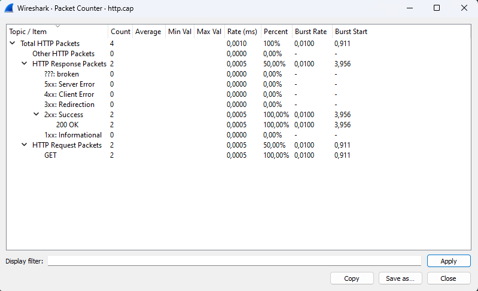
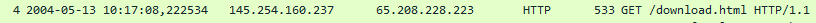
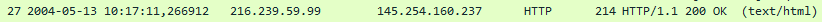
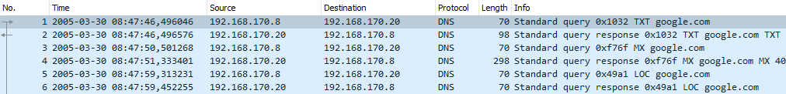
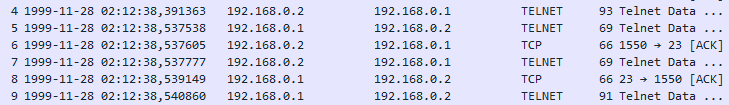

# Analisis http.cap, telnet-cooked.pcap, dan dns.cap

## 1. http.cap

Kita dapat melihat Statistik HTTP dengan membuka tab “Packet Counter” pada aplikasi Wireshark menampilkan statistik tentang paket yang ditangkap oleh Wireshark. Tabel pada tab ini terdiri dari 9 baris dan 8 kolom. Kolom-kolom tersebut adalah “Total HTTP Packets”, “Average”, “Min Val”, “Max Val”, “Rate (Perc)”, “Burst Rate”, “Burst Start”, dan “Other HTTP Packets”.

<strong>Gambar:</strong> 1.1 Packet Counter http.cap

Dari statistik http.cap diatas kita dapat simpulkan terdapat total 4 paket yang terdiri dari 2 HTTP response paket dan 2 HTTP request paket. Dari 2 HTTP request dari client tersebut semuanya direspon dengan response code 2.xx yang berarti success.

<strong>Gambar:</strong> 1.2 Packet Counter http.cap

<strong>Penjelasan kolom-kolom dalam tabel di atas:</strong>

> **No. : Nomor urutan paket.** 
> **Time: Waktu ketika paket ditangkap.** 
> **Source: Alamat IP sumber paket.** 
> **Destination: Alamat IP tujuan paket.** 
> **Protocol: Protokol yang digunakan oleh paket (misalnya, DNS dalam hal ini).** 
> **Length: Panjang paket dalam byte..** 
> **Info: Informasi tambahan tentang isi paket.** 

tabel menunjukkan paket-paket yang berisi data HTTP yang ditangkap oleh Wireshark. Protokol HTTP (Hypertext Transfer Protocol) digunakan untuk mentransfer data dalam bentuk halaman web dan konten terkait melalui internet.

Paket 4 adalah permintaan GET dari alamat IP lokal (145.454.160.237) ke server (65.208.228.223) untuk mengambil halaman "/download.html" melalui protokol HTTP/1.1. Paket 27 adalah respons dari server yang mengandung status "200 OK" bersama dengan konten halaman web dalam format HTML.

## 2. dns.cap

<strong>Gambar:</strong> 2.1 Tabel dns.cap

tabel menunjukkan paket-paket DNS yang ditangkap oleh Wireshark. Paket pertama adalah permintaan DNS (query) dari alamat IP 192.168.170.8 ke server DNS 192.168.170.20 untuk mencari alamat IP dari google.com. Paket kedua adalah respons dari server DNS  yang memberikan alamat IP dari google.com.

## 2. telnet-coocked.pcap

<strong>Gambar:</strong> 3.1 Tabel telnet-coocked.cap

Tabel menunjukkan paket-paket yang berisi data Telnet yang ditangkap oleh Wireshark. Telnet adalah protokol yang digunakan untuk koneksi teks jarak jauh, seperti akses ke shell atau konsol perangkat jarak jauh.

Paket 4 adalah data dari sumber (192.168.0.2) yang akan dikirim ke tujuan (192.168.0.1). Paket 5 adalah respons dari tujuan yang mengirimkan pesan.