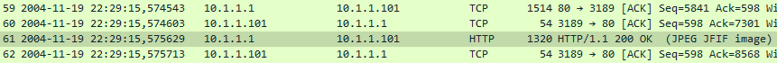
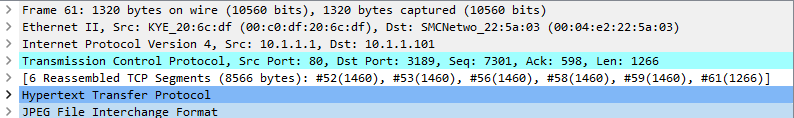
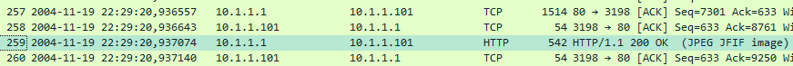
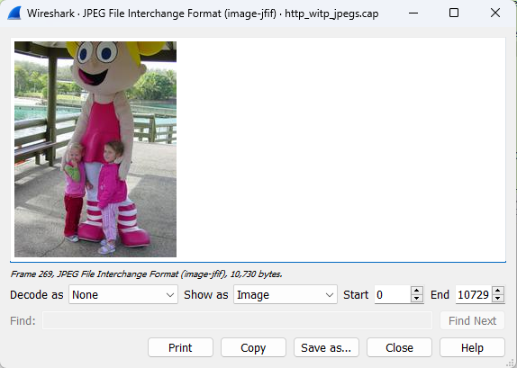
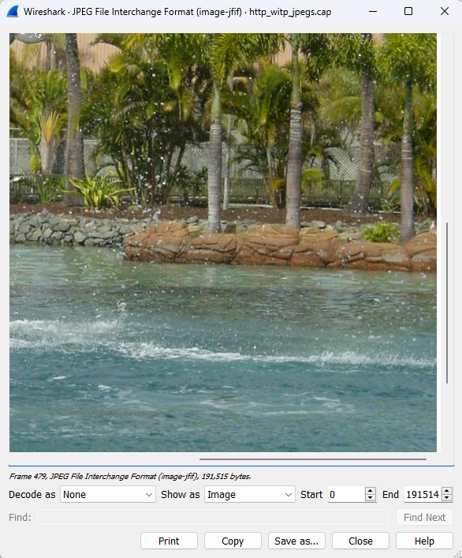

# HTTP with Jpeg

## Cara membuka jpeg pada wireshark

1. Pilih paket yang mengandung jpeg, paket tersebut ditandai dengan terdapatnya <strong>(JPEG JFIF image)</strong> pada kolom info 
2. Klik kanan <strong>JPEG File Interchage Format</strong> pada package detail 
3. Pilih <strong>Show Packet Bytes</strong> 
4. Akan muncul tampikan seperti dibawah 
5. Klik Save As jika ingin menyimpan

## Analisis 

Pada sample capture wireshark <strong>http_with_jpegs.cap</strong> terdapat 5 gambar antara lain :

1. Gambar pertama terdapat pada paket nomor 61. 
2. Gambar kedua terdapat pada paket ke 72 
3. Gambar ketiga terdapat pada paket ke 259 
4. Gambar ketiga terdapat pada paket ke 269 
5. Gambar ketiga terdapat pada paket ke 479 