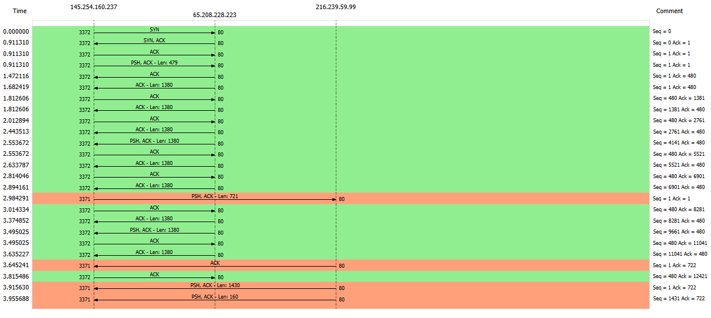
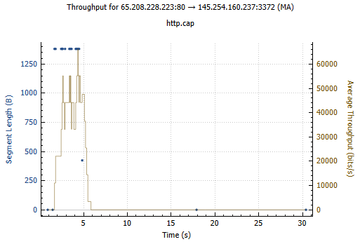
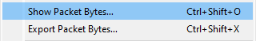
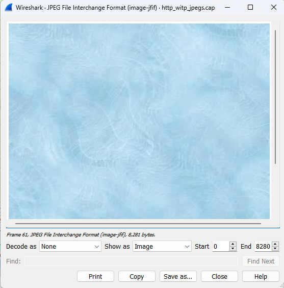
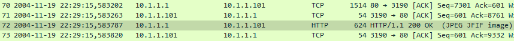
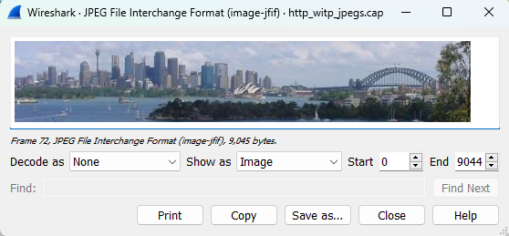
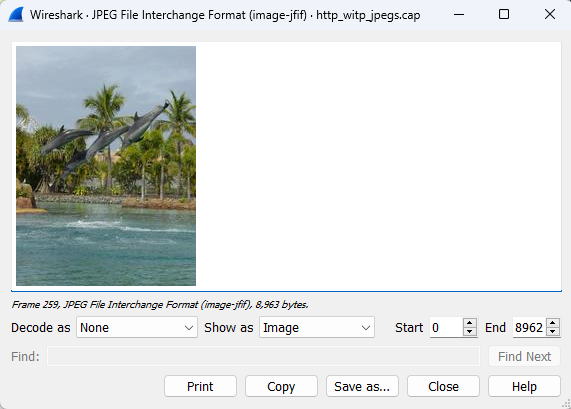
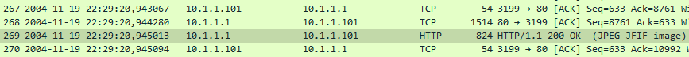
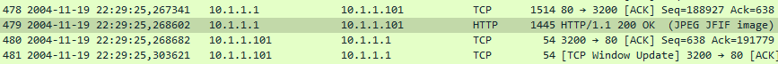

## <strong>TUGAS 1 - ANALISIS FLOW GRAPH</strong>

<strong>Gambar:</strong> 1.1 Flow Graph bagian 1

<strong>Gambar:</strong> 1.2 Flow Graph bagian 2 

Ini adalah diagram alur yang menggambarkan komunikasi TCP (Transmission Control Protocol) antara dua alamat IP: 145.254.160.237 (sumber) dan 216.239.59.99 (tujuan), dengan nomor port 3372 (sumber) dan 80 (tujuan). Flowgraph menunjukkan urutan paket yang dipertukarkan selama sesi TCP.

Berikut rincian peristiwa dan paket penting dalam komunikasi:

1. **Inisialisasi:**
    - Waktu: 0,000000
    - Sumber mengirimkan paket SYN ke tujuan (Seq = 0).
    - Tujuan merespon dengan paket SYN, ACK (Seq = 0, Ack = 1).
    - Sumber mengakui SYN, ACK dengan paket ACK (Seq = 1, Ack = 1).
    - Sumber mengirimkan paket PSH, ACK dengan panjang data 479 (Seq = 1, Ack = 1).

2. **Pertukaran Data:**
    - Paket data dipertukarkan dengan meningkatnya nomor urut dan nilai ACK.
    - Beberapa paket PSH, ACK dengan panjang bervariasi dikirim oleh sumber dan diakui oleh tujuan.
    - Nomor urut dan pengakuan terus bertambah pada setiap pertukaran.

3. **Lebih Banyak ACK dan Data:**
    - Di berbagai titik, paket ACK dipertukarkan untuk mengetahui data yang diterima.
    - Paket PSH, ACK terus dipertukarkan dengan bertambahnya nomor urut dan pengakuan.

4. **Aliran Kedua (IP 3371):**
    - Aliran terpisah dimulai dengan alamat IP 3371, berkomunikasi dengan port tujuan 80.
    - Mengirimkan paket PSH, ACK dengan panjang 721 dan nomor urut 1, mengakui data yang diterima sebelumnya.

5. **Pertukaran Data Lanjutan:**
    - PSH, paket ACK dipertukarkan antara sumber dan tujuan di kedua aliran.
    - Pengakuan dan nomor urut bertambah.

6. **Pemutusan Koneksi:**
    - Paket FIN, ACK dikirim dari sumber ke tujuan untuk memulai proses penghentian koneksi (Seq = 18365, Ack = 480).
    - Tujuan mengetahui paket FIN, ACK (Seq = 480, Ack = 18366).
    - Paket FIN, ACK lainnya dikirim dari sumber ke tujuan (Seq = 480, Ack = 18366).
    - Tujuan menerima paket FIN, ACK kedua (Seq = 18366, Ack = 481).

Diagram alur menggambarkan tipikal jabat tangan tiga arah pada awal komunikasi, pertukaran data, dan proses penghentian koneksi empat arah. Penting untuk dicatat bahwa analisis hanya didasarkan pada informasi yang diberikan dalam diagram alur.

## <strong>TUGAS 2 - ANALISIS PACKET COUNTER</strong>

<strong>Gambar:</strong> 2 Packet Counter 

Kita dapat melihat Statistik HTTP dengan membuka tab “Packet Counter” pada aplikasi Wireshark menampilkan statistik tentang paket yang ditangkap oleh Wireshark. Tabel pada tab ini terdiri dari 9 baris dan 8 kolom. Kolom-kolom tersebut adalah “Total HTTP Packets”, “Average”, “Min Val”, “Max Val”, “Rate (Perc)”, “Burst Rate”, “Burst Start”, dan “Other HTTP Packets”. Berikut adalah penjelasan lengkapnya :

1. Total HTTP Packets: Jumlah total paket HTTP yang terdeteksi oleh Wireshark.
2. Average: Rata-rata jumlah paket HTTP yang terdeteksi dalam satu detik.
3. Min Val: Jumlah minimum paket HTTP yang terdeteksi dalam satu detik.
4. Max Val: Jumlah maksimum paket HTTP yang terdeteksi dalam satu detik.
5. Rate (Perc): Persentase jumlah paket HTTP terhadap total paket yang terdeteksi.
6. Burst Rate: Jumlah maksimum paket HTTP yang terdeteksi dalam satu detik.
7. Burst Start: Waktu mulai dari burst rate.
Other HTTP Packets: Jumlah paket HTTP selain dari jenis-jenis yang disebutkan di atas.

Dari statistik http.cap diatas kita dapat simpulkan terdapat total 4 paket yang terdiri dari 2 HTTP response paket dan 2 HTTP request paket. Dari 2 HTTP request dari client tersebut semuanya direspon dengan response code 2.xx yang berarti success.

## <strong>TUGAS 3 - ANALISIS TROUGHPUT</strong>

Throughput adalah ukuran kecepatan dan efisiensi pengiriman data melalui jaringan atau sistem komunikasi dalam suatu periode waktu. Ini diukur dalam satuan seperti bps, Kbps, Mbps, atau Gbps, dan mencerminkan jumlah data yang dapat dikirim atau diterima dalam waktu tertentu. Semakin tinggi throughput, semakin banyak data yang bisa diakomodasi dalam jaringan dalam waktu yang sama.

<strong>Gambar:</strong> 3 Troughput

Tab “Throughput” pada aplikasi Wireshark menampilkan grafik yang menunjukkan throughput jaringan selama waktu tertentu. Grafik ini dapat membantu Anda memahami bagaimana jaringan digunakan dan apakah ada masalah throughput.

Grafik ini menunjukkan throughput dalam satuan bit per detik (bps) pada sumbu y dan waktu pada sumbu x. Anda dapat memilih untuk menampilkan grafik untuk seluruh jaringan atau hanya untuk protokol tertentu.

Untuk dapat melihat informasi paket dengan lebih detail kita dapat menghover titik-titik yang terdapat pada grafik, kemudian akan muncul keterangan seperti dibawah

> **1. Packet: 38**  
> **2. Time: 4.875s** 
> **3. Length: 424** 
> **4. Sequence Number : 17941** 
> **5. Acknowledgement Number : 480** 
> **6. Win : 6432**

## <strong>TUGAS 4 - CARA MENEMUKAN GAMBAR DENGAN WIRESHARK</strong>

> **http_witp_jpegs.cap**

1. Pilih paket yang mengandung jpeg, paket tersebut ditandai dengan terdapatnya <strong>(JPEG JFIF image)</strong> pada kolom info 
2. Klik kanan <strong>JPEG File Interchage Format</strong> pada package detail 
3. Pilih <strong>Show Packet Bytes</strong> 
4. Akan muncul tampikan seperti dibawah 
5. Klik Save As jika ingin menyimpan

## Analisis 

Pada sample capture wireshark <strong>http_with_jpegs.cap</strong> terdapat 5 gambar antara lain :

1. Gambar pertama terdapat pada paket nomor 61. 
2. Gambar kedua terdapat pada paket ke 72 
3. Gambar ketiga terdapat pada paket ke 259 
4. Gambar ketiga terdapat pada paket ke 269 
5. Gambar ketiga terdapat pada paket ke 479 