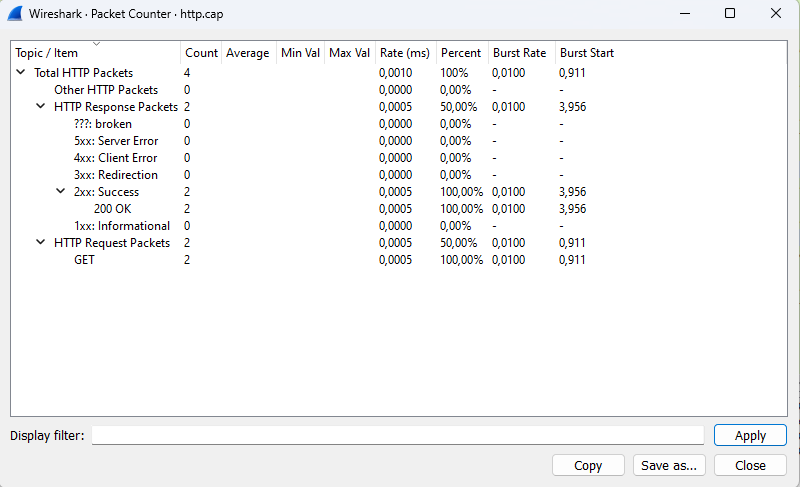

# Statistik HTTP

Kita dapat melihat Statistik HTTP dengan membuka tab “Packet Counter” pada aplikasi Wireshark menampilkan statistik tentang paket yang ditangkap oleh Wireshark. Tabel pada tab ini terdiri dari 9 baris dan 8 kolom. Kolom-kolom tersebut adalah “Total HTTP Packets”, “Average”, “Min Val”, “Max Val”, “Rate (Perc)”, “Burst Rate”, “Burst Start”, dan “Other HTTP Packets”. Berikut adalah penjelasan lengkapnya :

1. Total HTTP Packets: Jumlah total paket HTTP yang terdeteksi oleh Wireshark.
2. Average: Rata-rata jumlah paket HTTP yang terdeteksi dalam satu detik.
3. Min Val: Jumlah minimum paket HTTP yang terdeteksi dalam satu detik.
4. Max Val: Jumlah maksimum paket HTTP yang terdeteksi dalam satu detik.
5. Rate (Perc): Persentase jumlah paket HTTP terhadap total paket yang terdeteksi.
6. Burst Rate: Jumlah maksimum paket HTTP yang terdeteksi dalam satu detik.
7. Burst Start: Waktu mulai dari burst rate.
Other HTTP Packets: Jumlah paket HTTP selain dari jenis-jenis yang disebutkan di atas.

Dari statistik http.cap diatas kita dapat simpulkan terdapat total 4 paket yang terdiri dari 2 HTTP response paket dan 2 HTTP request paket. Dari 2 HTTP request dari client tersebut semuanya direspon dengan response code 2.xx yang berarti success.