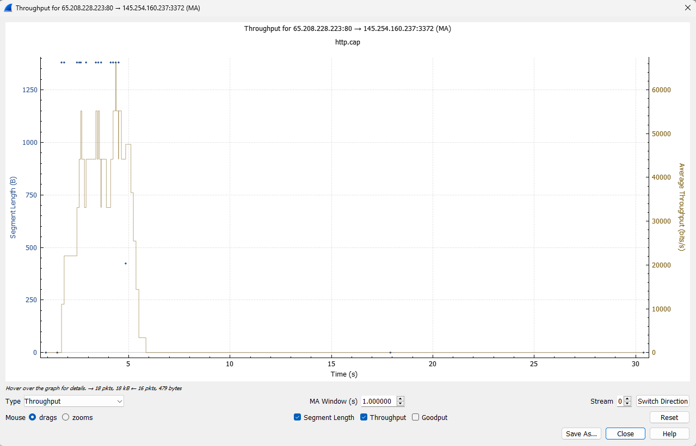

# Analisis Troughput

Tab “Throughput” pada aplikasi Wireshark menampilkan grafik yang menunjukkan throughput jaringan selama waktu tertentu. Grafik ini dapat membantu Anda memahami bagaimana jaringan digunakan dan apakah ada masalah throughput.

Grafik ini menunjukkan throughput dalam satuan bit per detik (bps) pada sumbu y dan waktu pada sumbu x. Anda dapat memilih untuk menampilkan grafik untuk seluruh jaringan atau hanya untuk protokol tertentu.

Untuk dapat melihat informasi paket dengan lebih detail kita dapat menghover titik-titik yang terdapat pada grafik, kemudian akan muncul keterangan seperti dibawah

