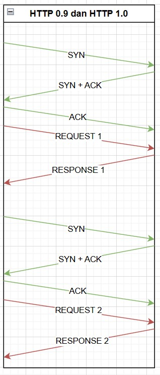
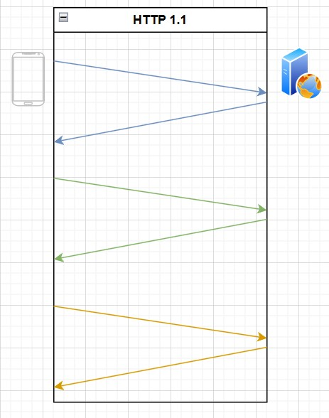
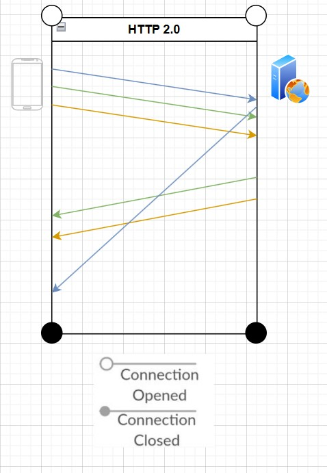

## PERKEMBANGAN HTTP

1. **HTTP 0.9**:

   - **Tahun Rilis:** 1991
   - **Karakteristik:** HTTP 0.9 adalah versi HTTP paling awal dan sangat sederhana. Ini hanya mendukung satu metode HTTP: "GET." Tidak ada header, dan responsenya hanya berisi konten HTML mentah.
   - **Keterbatasan Penting:** Kurangnya kemampuan untuk diubah dan fitur. Ini dirancang terutama untuk mentransfer dokumen hiperteks.

1. **HTTP 1.0**:

   - **Tahun Rilis:** 1996
   - **Karakteristik:** HTTP 1.0 memperkenalkan lebih banyak metode HTTP (misalnya, POST, HEAD). Ini juga memperkenalkan header dalam permintaan dan respons, yang memungkinkan penggunaan metadata yang lebih banyak dan penanganan kesalahan yang lebih baik. Namun, masih menggunakan koneksi TCP terpisah untuk setiap pasangan permintaan/respons.
   - **Keterbatasan Penting:** Kurangnya penggunaan koneksi yang efisien, yang menyebabkan laten tinggi saat memuat sumber daya yang berbeda-beda.

1. **HTTP 1.1**:

   - **Tahun Rilis:** 1997
   - **Karakteristik:** HTTP 1.1 secara signifikan meningkatkan kinerja dengan memungkinkan banyak permintaan dan respons untuk digandakan di atas satu koneksi TCP tunggal, mengurangi laten. Ini juga memperkenalkan fitur seperti koneksi tetap, pengecekan cache, dan enkoding berchunk untuk transfer data yang lebih baik.
   - **Keterbatasan Penting:** Meskipun ada peningkatan, HTTP 1.1 memiliki keterbatasan terkait dengan tidak efisiennya header, terutama saat memuat sumber daya yang berbeda-beda.

1. **HTTP/2.0**:

   - **Tahun Rilis:** 2015
   - **Karakteristik:** HTTP/2.0 adalah pembaruan besar dari protokol. Ini memperkenalkan framing biner, kompresi header (HPACK), dan multiplexing, yang secara signifikan meningkatkan kinerja dan mengurangi laten. Ini juga mengatur prioritas permintaan dan respons untuk penggunaan sumber daya yang efisien.
   - **Fitur Penting:** Kompresi header yang lebih efisien, pendorong server, dan prioritas sumber daya untuk memuat halaman lebih cepat.
   - **Keterbatasan Penting:** Meskipun HTTP/2 adalah peningkatan besar, umumnya memerlukan enkripsi (HTTPS) untuk sebagian besar implementasi, yang dianggap sebagai keterbatasan oleh beberapa pihak.

**PerbedaanTCP**:
TCP Keep-Alive dan Flow Control adalah dua konsep yang berbeda dalam protokol TCP (Transmission Control Protocol) yang digunakan dalam komunikasi jaringan. Mari kita bahas perbedaan antara keduanya:

- **TCP Keep-Alive:**
   - **Tujuan:** TCP Keep-Alive adalah mekanisme yang digunakan untuk mempertahankan koneksi TCP yang aktif dan mendeteksi jika koneksi terputus.
   - **Cara Kerja:** Ketika TCP Keep-Alive diaktifkan, komputer pengirim secara periodik (biasanya beberapa menit) mengirimkan paket ke komputer penerima dengan flag Keep-Alive. Jika komputer penerima tidak merespons dalam jangka waktu tertentu, pengirim menganggap koneksi telah terputus dan dapat mengambil tindakan yang sesuai (misalnya, menutup koneksi).
   - **Manfaat:** Ini membantu mencegah koneksi yang tidak aktif tetap terbuka, yang dapat menghemat sumber daya dan memastikan keandalan komunikasi.

- **Flow Control (Pengendalian Aliran):**
   - **Tujuan:** Flow control adalah mekanisme yang digunakan untuk mengontrol laju pengiriman data antara pengirim dan penerima agar tidak terlalu cepat sehingga penerima dapat mengatasi data yang diterimanya.
   - **Cara Kerja:** Flow control melibatkan penggunaan pengumpanan (buffering) di sisi penerima. Penerima memberi tahu pengirim tentang berapa banyak data yang dapat diterimanya dengan aman melalui penggunaan pesan-pesan TCP, seperti ACK (acknowledgment) dan jendela pengumpanan (window size).
   - **Manfaat:** Ini membantu mencegah kelebihan beban penerima, terutama ketika ada perbedaan dalam kecepatan pengirim dan penerima. Ini juga membantu menghindari pengiriman data yang terlalu cepat sehingga data tidak hilang atau terbuang.

Jadi, perbedaan utama antara TCP Keep-Alive dan Flow Control adalah bahwa TCP Keep-Alive digunakan untuk menjaga koneksi tetap aktif dan mendeteksi koneksi yang terputus, sementara Flow Control digunakan untuk mengendalikan laju pengiriman data antara pengirim dan penerima agar sesuai dengan kemampuan penerima. Keduanya adalah mekanisme yang berbeda dan memiliki tujuan yang berbeda dalam TCP.

Setiap versi berikutnya dari HTTP bertujuan untuk mengatasi keterbatasan versi sebelumnya dan meningkatkan efisiensi serta kinerja komunikasi web. HTTP/2.0, khususnya, membuat langkah besar dalam hal ini dan telah diadopsi secara luas.