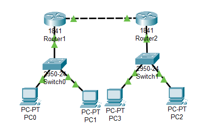
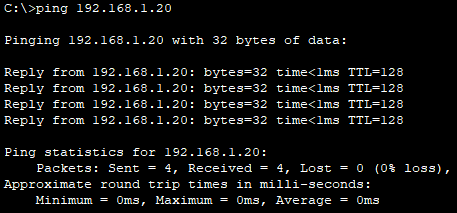
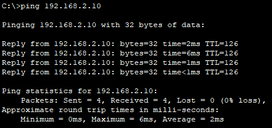
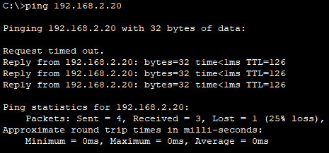
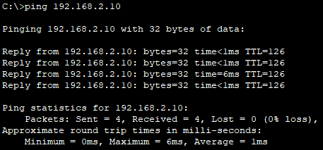
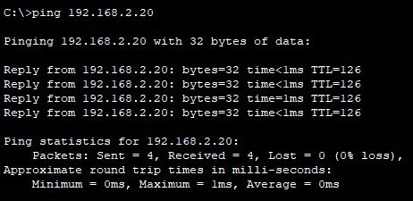
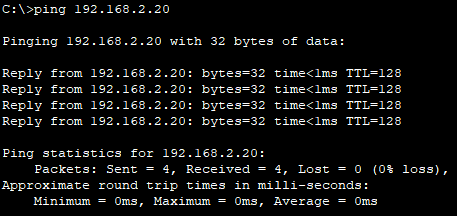

# PING SISCO PACKET TRACER

Untuk memungkinkan PC untuk saling mengirim ping satu sama lain dalam jaringan, diperlukan melakukan konfigurasi IP yang benar pada setiap perangkat, termasuk router dan PC. Di bawah ini adalah penjelasan tentang konfigurasi IP dan mengapa PC dapat saling mengirim ping.

**Router:** Setiap router memiliki dua antarmuka yang menghubungkan jaringan yang berbeda. Sebagai contoh, kita akan menggunakan dua jaringan berbeda: Jaringan A dan Jaringan B. Konfigurasi antarmuka router mungkin terlihat seperti ini:

Router 1:
  - Antarmuka 0/0:
    - IP Address: 192.168.1.1
    - Subnet Mask: 255.255.255.0
  - Antarmuka 0/1:
    - IP Address: 10.0.1.1
    - Subnet Mask: 255.255.255.0

Router 2:
  - Antarmuka 0/0:
    - IP Address: 192.168.2.1
    - Subnet Mask: 255.255.255.0
  - Antarmuka 0/1:
    - IP Address: 10.0.1.2
    - Subnet Mask: 255.255.255.0

**Switch:** Setiap switch menghubungkan dua PC dalam jaringan yang sama. Misalnya:

Switch 1:
  - PC1:
    - IP Address: 192.168.1.10
    - Subnet Mask: 255.255.255.0
  - PC2:
    - IP Address: 192.168.1.20
    - Subnet Mask: 255.255.255.0

Switch 2:
  - PC3:
    - IP Address: 192.168.2.10
    - Subnet Mask: 255.255.255.0
  - PC4:
    - IP Address: 192.168.2.20
    - Subnet Mask: 255.255.255.0

## Penjelasan
Setiap perangkat dalam jaringan memiliki alamat IP yang unik dan subnet mask yang sesuai. PC dalam jaringan yang sama (misalnya, PC1 dan PC2 di Switch 1) memiliki alamat IP dalam jaringan yang sama dengan subnet mask yang benar, sehingga mereka dapat berkomunikasi langsung satu sama lain tanpa perlu melibatkan router.

Router di sini berfungsi sebagai gateway untuk menghubungkan dua jaringan yang berbeda. Router 1 menghubungkan Jaringan A (192.168.1.0/24) dan Jaringan B (10.0.1.0/24), sedangkan Router 2 menghubungkan Jaringan A (192.168.2.0/24) dan Jaringan B (10.0.1.0/24).

Ketika PC ingin mengirim ping ke PC di jaringan yang berbeda, mereka akan mengirim paket ke gateway (router) mereka, yaitu Router 1 atau Router 2. Router akan memeriksa tabel rute dan meneruskan paket ke tujuan yang sesuai.

Dengan konfigurasi IP yang benar dan tabel rute yang sesuai di router, PC dapat mengirim ping satu sama lain melalui router dan antarmuka jaringan yang sesuai, sehingga memungkinkan komunikasi antar-jaringan.

## Hasil

* **pc 1 ke pc 2**

* **pc 1 ke pc 3**

* **pc 1 ke pc 4**

* **pc 2 ke pc 3**

* **pc 2 ke pc 4**

* **pc 3 ke pc 4**
