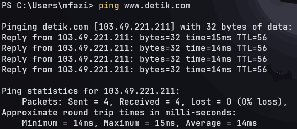
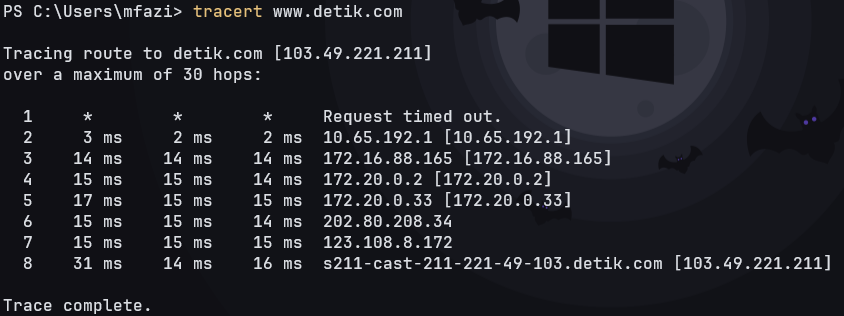

# PING DAN TRACERT

## Ping

Perintah ping adalah perintah yang digunakan dalam untuk menguji konektivitas jaringan dan mengukur waktu tempuh (latensi) antara komputer  dan sebuah tujuan (biasanya alamat IP atau nama domain). Perintah ini berguna untuk memeriksa apakah komputer dapat mencapai tujuan tertentu melalui jaringan, dan juga untuk memonitor stabilitas jaringan.

Command ping dapat menampilkan beberapa informasi, termasuk:

1. Waktu Respon (Round-Trip Time/RTT): Ini adalah waktu yang dibutuhkan untuk paket data pergi dari komputer Anda ke tujuan dan kembali lagi. Waktu ini diukur dalam milidetik (ms).

2. Jumlah paket yang dikirim, diterima, dan hilang: Perintah ping akan menghitung berapa banyak paket yang dikirim, berapa banyak yang diterima oleh tujuan, dan berapa banyak yang hilang di jalan.

3. Statistik ping: Setelah selesai, perintah ping akan menampilkan statistik ping, termasuk rata-rata waktu respon dan persentase paket yang hilang.

Berikut ini contoh keluaran dari perintah ping:

Pada contoh di atas perintah ping menunjukkan pengujian konektivitas ke situs web detik.com, yang memiliki alamat IP 103.49.221.211.

1. Pinging detik.com [103.49.221.211] with 32 bytes of data: Ini adalah pesan awal yang memberitahu bahwa sedang dilakukan ping ke alamat IP 103.49.221.211 dengan mengirimkan paket data sebesar 32 byte.

2. Reply from 103.49.221.211: bytes=32 time=15ms TTL=56: Ini adalah respons dari alamat IP 103.49.221.211 terhadap ping yang dikirimkan. Ada empat baris respons yang menunjukkan bahwa keempat paket yang dikirimkan diterima oleh tujuan.
   * bytes=32 menunjukkan bahwa ukuran paket yang dikirim adalah 32 byte.
   * time=15ms menunjukkan bahwa waktu respon (Round-Trip Time/RTT) dari alamat IP 103.49.221.211 adalah sekitar 15 milidetik (ms).
   * TTL=56 adalah nilai Time-to-Live (TTL) yang menunjukkan berapa banyak hop yang dilewati oleh paket sebelum mencapai tujuan. Nilai TTL ini akan berkurang setiap kali paket melewati router, dan jika mencapai nol, paket akan dihapus.

3. Ping statistics for 103.49.221.211: Bagian ini memberikan statistik dari pengujian ping yang Adilakukan.
   * Packets: Sent = 4 menunjukkan bahwa telah mengirim 4 paket ping.
   * Received = 4 menunjukkan bahwa semua 4 paket tersebut diterima oleh tujuan.
   * Lost = 0 (0% loss) menunjukkan bahwa tidak ada paket yang hilang dalam pengujian ini, sehingga tidak ada paket yang gagal mencapai tujuan.

4. Approximate round trip times in milli-seconds: Bagian ini memberikan informasi tentang waktu respon rata-rata dari semua paket ping yang dikirimkan.
   * Minimum = 14ms adalah waktu respon minimum, yaitu 14 ms.
   * Maximum = 15ms adalah waktu respon maksimum, yaitu 15 ms.
   * Average = 14ms adalah waktu respon rata-rata dari keempat paket ping yang Adikirimkan, yaitu sekitar 14 ms.

Hasil ini menunjukkan bahwa koneksi ke detik.com (dengan alamat IP 103.49.221.211) adalah baik, dengan semua paket ping berhasil mencapai tujuan tanpa ada yang hilang. Waktu respon juga cukup cepat, dengan rata-rata sekitar 14 ms, yang merupakan indikasi koneksi yang responsif ke situs tersebut.

## Tracert

Perintah tracert digunakan untuk menampilkan informasi untuk beberapa titik hop, menunjukkan jalur dari komputer ke tujuan. Ini akan terus berlanjut sampai mencapai tujuan atau mencapai batas maksimum jumlah hop (yang dapat ditentukan dengan opsi -h). Jika suatu titik hop tidak merespons permintaan ICMP, itu akan ditampilkan sebagai asterisk (*), yang mengindikasikan waktu habis (timeout).

Berikut penjelasan untuk setiap kolom dalam perintah tracert:

1. **Nomor Hop:** Ini adalah nomor urutan yang diberikan pada setiap titik (hop) dalam jalur. Dimulai dari angka 1 untuk titik pertama (router lokal) dan bertambah 1 untuk setiap titik berikutnya.

2. **RTT (Round-Trip Time):** Kolom ini menampilkan waktu yang dibutuhkan untuk sebuah paket ICMP (Internet Control Message Protocol) pergi dari komputer ke titik hop tertentu dan kembali lagi. Waktu ini diukur dalam milidetik (ms). RTT adalah total waktu yang diperlukan untuk paket pergi ke titik tersebut dan mendapatkan balasan.

3. **Alamat IP:** Kolom ini menampilkan alamat IP dari router atau perangkat pada setiap titik dalam jalur. Ini dapat membantu mengidentifikasi komponen jaringan tertentu yang dilewati oleh paket.

4. **Nama Host (jika tersedia):** Jika router atau perangkat pada titik hop memiliki catatan DNS terbalik (nama host), tracert akan mencoba menampilkannya. Ini dapat membantu mengidentifikasi penyedia jaringan atau lokasi yang terkait dengan titik hop tersebut.

Berikut ini contoh keluaran dari perintah tracert:

1. **Hop 1:** Pada hop pertama, terlihat "Request timed out." Ini menunjukkan bahwa perangkat atau router pertama dalam jalur (mungkin router lokal) tidak merespons permintaan ICMP yang dikirim oleh tracert. Karena hop ini merupakan titik awal perjalanan, tracert tidak dapat menentukan RTT atau alamat IP untuk hop ini.

2. **Hop 2:** Pada hop kedua, terlihat bahwa waktu tempuh (RTT) sekitar 3 ms. Ini menunjukkan bahwa paket ICMP berhasil mencapai router atau perangkat kedua dalam jalur, yang memiliki alamat IP 10.65.192.1. Hop ini adalah langkah pertama dalam perjalanan melalui jaringan setelah meninggalkan router lokal.

3. **Hop 3-6:** Hop ketiga hingga keenam juga menunjukkan RTT yang bervariasi, yang mengindikasikan bahwa paket ICMP telah berhasil mencapai beberapa router atau perangkat di dalam jaringan. Setiap hop memiliki alamat IP yang berbeda, yang mungkin mewakili router atau perangkat yang berbeda di jalur menuju tujuan. Alamat IP-alamat IP ini adalah 172.16.88.165, 172.20.0.2, 172.20.0.33, dan 202.80.208.34.

4. **Hop 7:** Pada hop ketujuh, RTT sekitar 15 ms dan alamat IP-nya adalah 123.108.8.172. Ini menunjukkan bahwa paket ICMP telah mencapai hop yang lebih dalam di jaringan, dan koneksi masih berjalan dengan baik.

5. **Hop 8 (Tujuan):** Hop terakhir adalah tujuan yang ingin dilacak, yaitu s211-cast-211-221-49-103.detik.com dengan alamat IP 103.49.221.211. Ini adalah alamat tujuan akhir yang ingin dicapai.

