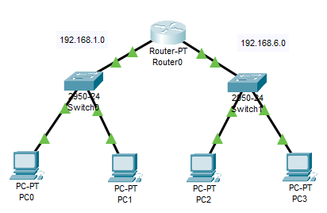
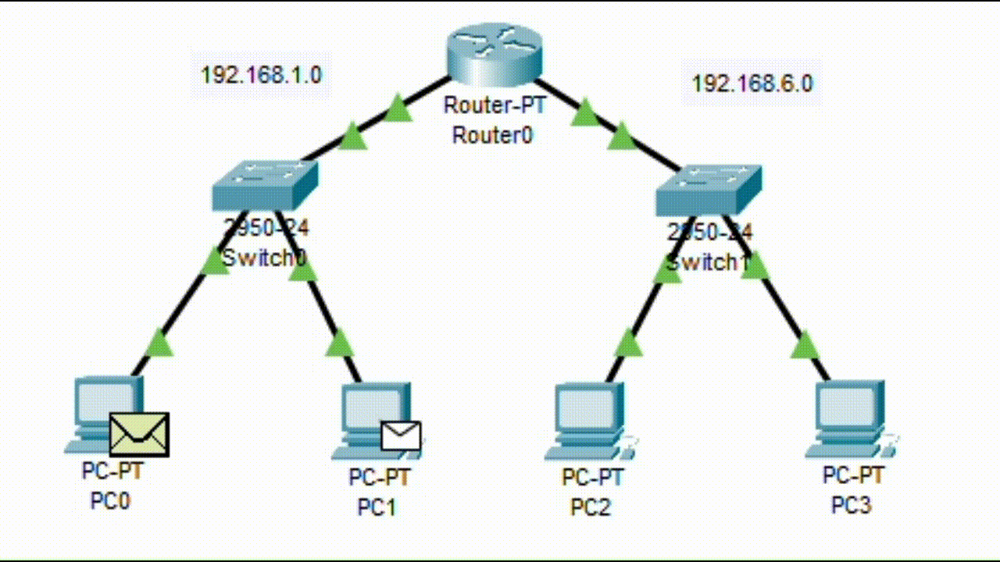
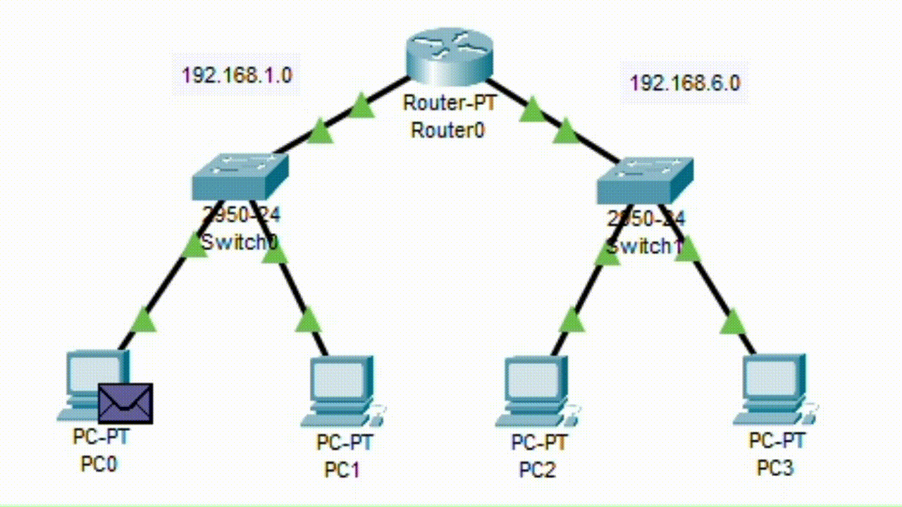
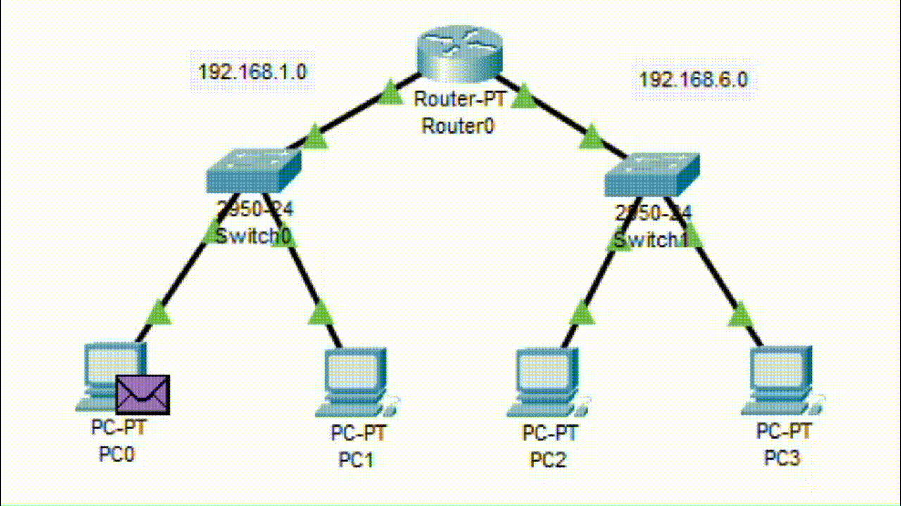
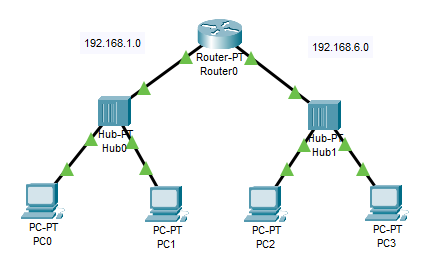
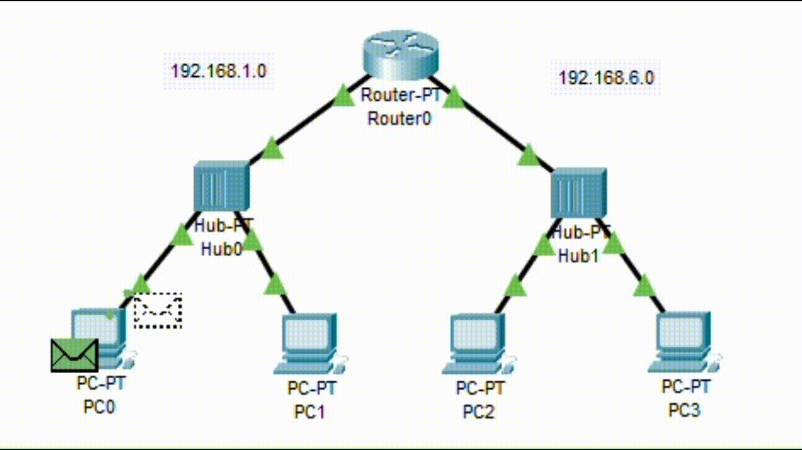
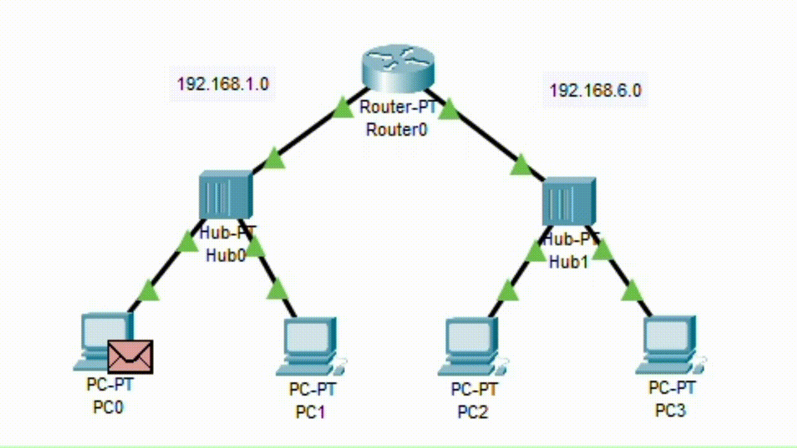

# PACKET TRACER NETWORK CONFIGURATION

## 1 Router - 2 Switch - 4 Pc

Jaringan di atas memiliki dua subnet yang terpisah dengan IP address 192.168.1.0/24 dan 192.168.6.0/24, yang terhubung melalui router. PC dalam subnet pertama terhubung ke Switch 0, sementara PC dalam subnet kedua terhubung ke Switch 1. Semua perangkat tersebut dihubungkan oleh router yang mengatur lalu lintas antar subnet ini. Berikut adalah konfigurasinya:

**Perangkat Jaringan:**
* Router 0
* Switch 0
* Switch 1
* PC 0 (terhubung ke Switch 0)
* PC 1 (terhubung ke Switch 0)
* PC 2 (terhubung ke Switch 1)
* PC 3 (terhubung ke Switch 1)

**Konfigurasi IP:**
* Router:
  * Port LAN yang terhubung ke Switch 0: 192.168.1.0
  * Port LAN yang terhubung ke Switch 1: 192.168.6.0
* PC 0: 192.168.1.2
* PC 1: 192.168.1.3
* PC 2: 192.168.6.2
* PC 3: 192.168.6.3

**Hubungan Perangkat:**
* Router terhubung ke Switch 0 dan Switch 1.
* PC 0 dan PC 1 terhubung ke Switch 0.
* PC 2 dan PC 3 terhubung ke Switch 1.

### 1. Ping 192.168.1.2 -> 192.168.1.3 (BRODCAST)

mekanisme broadcast digunakan hanya dalam proses ARP untuk menentukan alamat MAC tujuan saat komunikasi pertama kali terjadi antara dua PC yang belum saling kenal. Setelah itu, komunikasi berlangsung menggunakan alamat MAC yang telah diketahui.

1. PC 0 (192.168.1.2) ingin melakukan ping ke PC 1 (192.168.1.3). Ketika PC 0 mencoba mengirim paket, ia menyadari bahwa PC 1 berada dalam jaringan yang sama (subnet yang sama), yaitu 192.168.1.0.

2. PC 0 menentukan bahwa alamat IP PC 1 (192.168.1.3) berada dalam jaringan yang sama, sehingga ia tidak perlu mengirim paket ke router untuk mencapai tujuan. PC 0 tahu bahwa PC 1 ada di jaringan lokal (LAN) yang sama karena keduanya terhubung ke Switch 0, dan Switch 0 adalah perangkat jaringan yang beroperasi di tingkat Layer 2 (Data Link Layer).

3. PC 0 menciptakan paket ICMP (ping) yang ditujukan ke alamat IP 192.168.1.3 (PC 1). Paket ini akan memiliki alamat MAC tujuan yang sesuai dengan alamat MAC PC 1 di jaringan lokal.

4. Namun, karena PC 0 belum tahu alamat MAC PC 1 (karena PC 0 belum pernah berkomunikasi dengan PC 1 sebelumnya), PC 0 harus melakukan proses ARP (Address Resolution Protocol) untuk mengidentifikasi alamat MAC PC 1.

5. PC 0 mengirim pesan ARP broadcast ke alamat MAC broadcast (FF:FF:FF:FF:FF:FF) ke dalam jaringan lokal (subnet) yang bertanya, "Siapa yang memiliki alamat IP 192.168.1.3?" Ini adalah mekanisme broadcast yang digunakan untuk menemukan alamat MAC pemilik alamat IP yang dituju.

6. Switch 0 menerima pesan ARP broadcast dan mengirimkannya ke semua perangkat di jaringan lokal kecuali perangkat pengirimnya (PC 0) karena ini adalah tindakan broadcast. Ini berarti bahwa semua perangkat di jaringan lokal, termasuk PC 1, akan menerima pesan ARP.

7. PC 1 menerima pesan ARP broadcast dan meresponsnya dengan mengirimkan pesan ARP yang berisi alamat MAC-nya ke PC 0.

8. PC 0 menerima pesan ARP dari PC 1, sehingga sekarang ia tahu alamat MAC PC 1.

9. PC 0 mengirim paket ICMP (ping) ke PC 1 dengan menggunakan alamat MAC PC 1 sebagai tujuan, sehingga paket akan langsung dikirimkan ke PC 1 melalui Switch 0.

10. PC 1 menerima paket ICMP (ping) dari PC 0 dan meresponsnya jika konfigurasi jaringan dan firewall memungkinkan.

### 2. Ping 192.168.1.2 -> 192.168.1.3

Dalam situasi ini, karena PC 0 dan PC 1 sudah saling mengenal dan memiliki informasi alamat MAC satu sama lain, tidak diperlukan mekanisme broadcast atau permintaan ARP. Paket ICMP (ping) dikirimkan langsung ke alamat MAC PC 1 melalui Switch 0 dan diterima oleh PC 1 tanpa perlu mencari tahu alamat MAC terlebih dahulu.

1. PC 0 (192.168.1.2) ingin melakukan ping ke PC 1 (192.168.1.3). Karena keduanya sudah saling mengenal, PC 0 tahu alamat MAC dari PC 1.

2. PC 0 membuat paket ICMP (ping) yang ditujukan ke alamat IP 192.168.1.3 (PC 1) dan menentukan alamat MAC tujuan yang sesuai dengan alamat MAC PC 1.

3. PC 0 mengirimkan paket ICMP ke Switch 0. Switch 0 tahu bahwa PC 1 terhubung ke port-nya dan akan meneruskan paket tersebut ke PC 1 berdasarkan alamat MAC tujuan yang telah ditentukan oleh PC 0.

4. PC 1 menerima paket ICMP dari PC 0 dan meresponsnya jika konfigurasi jaringan dan firewall memungkinkan.

### 3. Ping 192.168.1.2 -> 192.168.6.2 (BRODCAST)

Ketika PC 0 (192.168.1.2) ingin melakukan ping ke PC 2 (192.168.6.2) dan keduanya berada di subnet yang berbeda, maka prosesnya akan melibatkan router sebagai perangkat yang menghubungkan dua subnet yang berbeda. Dalam proses ini, mekanisme broadcast terjadi ketika PC 0 mencoba menentukan alamat MAC dari router, karena router adalah gateway ke subnet yang berbeda.

Dalam hal ini, mekanisme broadcast terjadi saat PC 0 mencoba mengetahui alamat MAC router (step 3 dan 4) untuk mengirimkan paket ke router. Setelah alamat MAC router ditemukan, komunikasi antara PC 0 dan PC 2 melibatkan alamat MAC router sebagai perantara, dan tidak diperlukan mekanisme broadcast tambahan.

1. PC 0 (192.168.1.2) ingin melakukan ping ke PC 2 (192.168.6.2). Karena keduanya berada di subnet yang berbeda, PC 0 tahu bahwa untuk mencapai subnet 192.168.6.0, ia harus menggunakan router.

2. PC 0 menciptakan paket ICMP (ping) dengan alamat IP tujuan 192.168.6.2. Namun, PC 0 tidak tahu alamat MAC dari router.

3. PC 0 perlu mengetahui alamat MAC router untuk mengirimkan paket ICMP ke router. Oleh karena itu, PC 0 melakukan permintaan ARP broadcast ke alamat MAC broadcast (FF:FF:FF:FF:FF:FF) dalam jaringan lokal (subnet 192.168.1.0) dengan pertanyaan, "Siapa yang memiliki alamat IP 192.168.1.1?" Alamat IP 192.168.1.1 adalah alamat IP router yang terhubung ke subnet 192.168.1.0.

4. Switch 0 menerima pesan ARP broadcast dari PC 0 dan mengirimkannya ke semua perangkat di jaringan lokal, termasuk router.

5. Router menerima pesan ARP broadcast yang menyatakan bahwa ada permintaan untuk alamat IP 192.168.1.1. Router kemudian merespons pesan ARP ini dengan mengirimkan alamat MAC-nya ke PC 0.

6. PC 0 menerima respons ARP dari router, sehingga sekarang ia tahu alamat MAC dari router.

7. PC 0 menggunakan alamat MAC router sebagai alamat tujuan dan mengirimkan paket ICMP ke router melalui Switch 0.

8. Router menerima paket ICMP dari PC 0 dan tahu bahwa paket ini harus diarahkan ke subnet 192.168.6.0 untuk mencapai PC 2.

9. Router melakukan forwarding paket dan mengirimkannya ke Switch 1 melalui koneksi antara Router 0 dan Switch 1.

10. Switch 1 menerima paket dan memutuskan untuk mengirimkannya ke PC 2 berdasarkan alamat MAC tujuan yang telah ditentukan dalam paket ICMP.

11. PC 2 (192.168.6.2) menerima paket ICMP dari PC 0 dan merespons jika konfigurasi jaringan dan firewall memungkinkan.

### 4. Ping 192.168.1.2 -> 192.168.6.2

Dalam situasi ini, karena PC 0 dan PC 2 sudah saling mengenal dan memiliki informasi alamat MAC satu sama lain, tidak diperlukan mekanisme broadcast atau permintaan ARP. Paket ICMP (ping) dikirimkan langsung ke alamat MAC PC 2 melalui Switch 0 dan diterima oleh PC 2 tanpa perlu mencari tahu alamat MAC terlebih dahulu. Router digunakan sebagai perantara dalam perjalanan paket antar subnet, tetapi karena alamat MAC PC 2 sudah diketahui, tidak ada mekanisme broadcast yang diperlukan dalam kasus ini.

1. PC 0 (192.168.1.2) ingin melakukan ping ke PC 2 (192.168.6.2). Karena keduanya sudah saling mengenal, PC 0 tahu alamat MAC dari PC 2 dan tahu bahwa untuk mencapai PC 2 di subnet 192.168.6.0, ia harus menggunakan router.

2. PC 0 menciptakan paket ICMP (ping) dengan alamat IP tujuan 192.168.6.2 dan menentukan alamat MAC PC 2 sebagai alamat tujuan dalam paket.

4. PC 0 mengirimkan paket ICMP ke Switch 0. Switch 0 tahu bahwa PC 2 terhubung ke port-nya dan akan meneruskan paket tersebut ke PC 2 berdasarkan alamat MAC tujuan yang telah ditentukan oleh PC 0.

5. PC 2 (192.168.6.2) menerima paket ICMP dari PC 0 dan meresponsnya jika konfigurasi jaringan dan firewall memungkinkan.

## 1 Router - 2 Hub - 4 Pc

Ketika mengganti Switch 0 dan Switch 1 dengan menggunakan hub 0 dan hub 1 dalam jaringan, maka seluruh lalu lintas jaringan akan digunakan dalam bentuk broadcast. Hubs beroperasi di tingkat fisik (Layer 1) dalam model OSI, dan mereka memancarkan semua data yang diterima ke semua perangkat yang terhubung ke hub tersebut. Inilah yang membuat mereka berbeda dengan switch yang cerdas dan dapat membatasi lalu lintas hanya ke perangkat yang relevan. Berikut adalah konfigurasinya:

**Perangkat Jaringan:**
* Router 0
* Hub 0
* Hub 1
* PC 0 (terhubung ke Hub 0)
* PC 1 (terhubung ke Hub 0)
* PC 2 (terhubung ke Hub 1)
* PC 3 (terhubung ke Hub 1)

**Konfigurasi IP:**
* Router:
  * Port LAN yang terhubung ke Hub 0: 192.168.1.0
  * Port LAN yang terhubung ke Hub 1: 192.168.6.0
* PC 0: 192.168.1.2
* PC 1: 192.168.1.3
* PC 2: 192.168.6.2
* PC 3: 192.168.6.3

**Hubungan Perangkat:**
* Router terhubung ke Hub 0 dan Hub 1.
* PC 0 dan PC 1 terhubung ke Hub 0.
* PC 2 dan PC 3 terhubung ke Hub 1.

### 1. Ping 192.168.1.2 -> 192.168.1.3

Dalam situasi ini, karena penggunaan hub, setiap paket yang dikirim dari PC 0 ke hub 0 akan didistribusikan ke semua perangkat yang terhubung ke hub tersebut. Inilah yang disebut dengan mekanisme broadcast karena semua perangkat dalam jaringan mendengar dan menerima paket yang dikirim, bahkan jika paket tersebut sebenarnya ditujukan hanya untuk PC 1. Hal ini dapat menyebabkan overhead lalu lintas dan dapat mengganggu jaringan jika terdapat banyak perangkat yang aktif di jaringan. Switch yang lebih cerdas akan dapat membatasi lalu lintas hanya ke perangkat yang relevan dan meminimalkan mekanisme broadcast.

1. PC 0 (192.168.1.2) ingin melakukan ping ke PC 1 (192.168.1.3).

2. PC 0 menciptakan paket ICMP (ping) yang ditujukan ke alamat IP 192.168.1.3 dan mengirimkannya ke hub 0.

3. Hub 0 menerima paket dan mengirimkannya ke semua perangkat yang terhubung ke hub tersebut, termasuk PC 1 (192.168.1.3).

4. PC 1 menerima paket ICMP dari PC 0 dan merespons jika konfigurasi jaringan dan firewall memungkinkan.

### 2. Ping 192.168.1.2 -> 192.168.6.2

Dalam situasi ini, karena penggunaan hub, setiap paket yang dikirim dari PC 0 ke hub 0 akan disiarkan ke semua perangkat yang terhubung ke hub tersebut, termasuk PC 2 yang berada di subnet yang berbeda. Hal ini menciptakan mekanisme broadcast yang ineffisien dan dapat menyebabkan overhead lalu lintas jaringan yang signifikan. Switch yang lebih cerdas akan dapat membatasi lalu lintas hanya ke perangkat yang relevan dan meminimalkan mekanisme broadcast, yang mana akan lebih efisien dalam jaringan yang lebih besar atau lebih kompleks.

1. PC 0 (192.168.1.2) ingin melakukan ping ke PC 2 (192.168.6.2).

2. PC 0 menciptakan paket ICMP (ping) yang ditujukan ke alamat IP 192.168.6.2 dan mengirimkannya ke hub 0.

3. Hub 0 menerima paket dan mengirimkannya ke semua perangkat yang terhubung ke hub tersebut, termasuk PC 1 (192.168.1.3) dan juga ke hub 1.

4. Hub 1 menerima paket dan mengirimkannya ke semua perangkat yang terhubung ke hub tersebut, termasuk PC 2 (192.168.6.2).

5. PC 2 (192.168.6.2) menerima paket ICMP dari PC 0 dan merespons jika konfigurasi jaringan dan firewall memungkinkan.